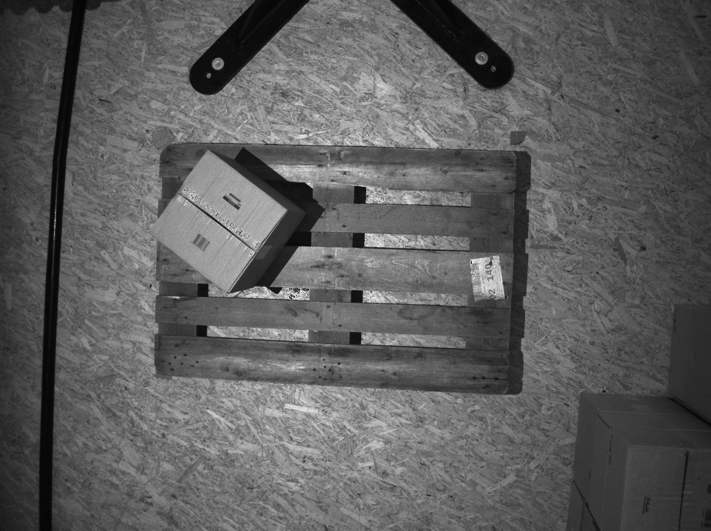
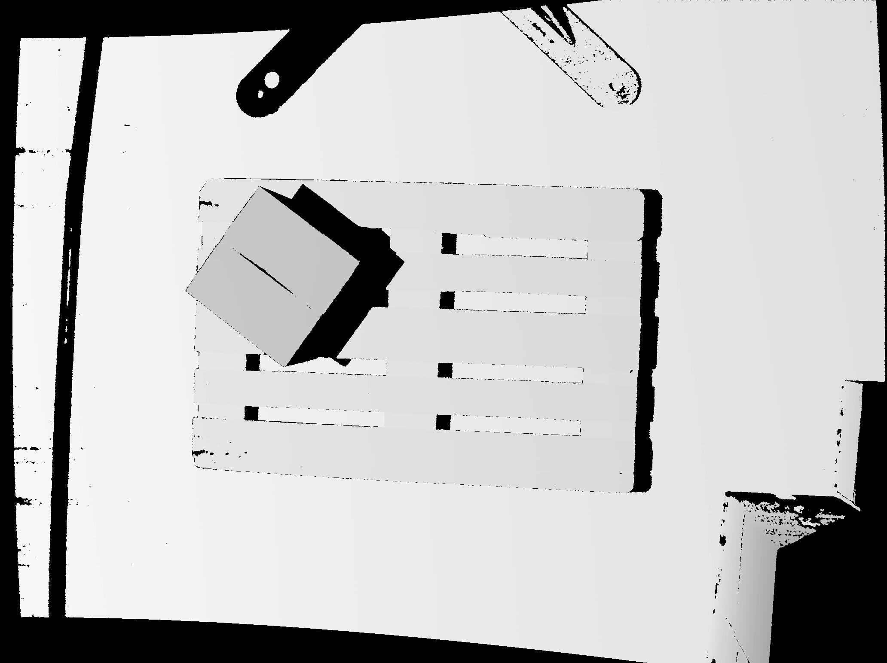
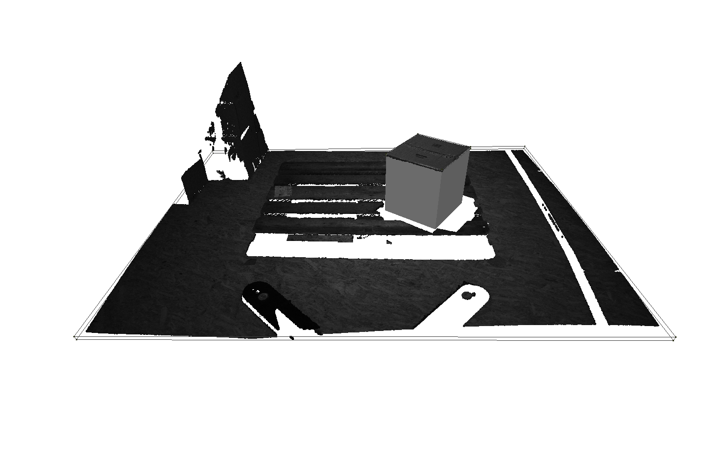
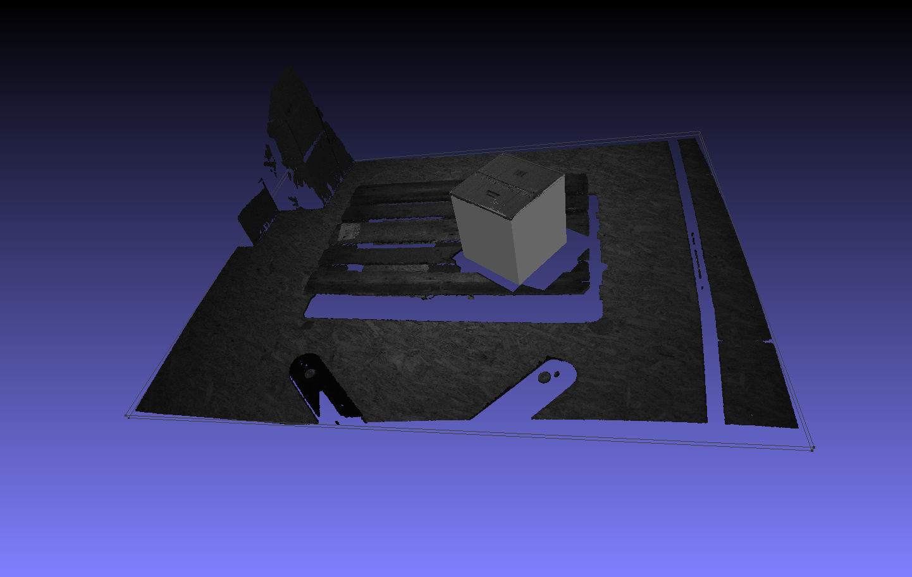

# Box Pose Estimation

This package contains a method for box pose estimation from RGBD camera using geometrical classical methods. 

Given such an RGBD image, which is typical for most robotics picking applications. And given the camera extrinsics and intrinsics.





The objective is to detect the box dimensions and its pose using geometrical methods



### How it works

---

1. Convert RGBD image to a point cloud.
2. Detect planar batches from the point cloud using statistical algorithm [[ArujoAndOliveira2020]](https://www.open3d.org/docs/0.18.0/tutorial/reference.html#ArujoAndOliveira2020) implemented by open3d.
3. Find the floor (plane with the maximum volume).
4. Find all horizontal planes (planes parallel to the floor).
5. Find the box surface (horizontal plane with the maximum distance to the floor).
6. Given the floor, box surface, and pallet height, find the box dimensions.

### Assumptions

1. The floor always dominates the scene.
2. The box we interested to detect is always the closest horizontal surface to the camera.
3. The pallet height is constant and known.

### How to run

---

1. Clone the package

```bash
git clone https://github.com/AbdElRahmanFarhan/box_pose_estimation
```

1. Build the docker image

```bash
cd box_pose_estimation
docker build . -t box_pose_img
```

1. Run the container

```bash
docker run -v /absolute_path/to/box_pose_estimation/data:/home/data -it box_pose_img
```

### Visualize the results

---

Output from the terminal. It 

```bash
Start box pose estimation
Read camera parameters
Create a point cloud from RGB and depth
Save the point cloud in /home/data/results/pcd.ply
Detect the Floor
Save the Floor in /home/data/results/floor.ply
Detect the surface of the box then get the whole box
save the box surface in /home/data/results/box_surface.ply
Save the box in /home/data/results/box.ply
The pose of the object relative to the camera frame is:
[[ 0.56617101 -0.76133504 -0.31594056 -0.0531412 ]
 [-0.79776736 -0.60255059  0.02237968 -2.3469073 ]
 [-0.20740834  0.23937712 -0.94851448  2.50505253]
 [ 0.          0.          0.          1.        ]]
Save the pose in/home/data/results/pose.json
```

The container generates different ply files inside the data/results folder. To visualize the whole scene with the detected box, do the following:

```bash
sudo apt-get install meshlab
cd /path/to/data/results
meshlab *.ply
```

This will open meshlab and you can visualize it!

